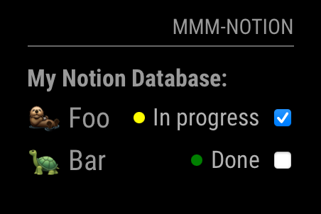
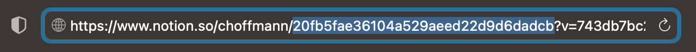

# MMM-Notion

This is a module for the [MagicMirror²](https://github.com/MichMich/MagicMirror/).
This module shows you your favorite Notion databases on MagicMirror. All you need is to create a [Notion integration](https://www.notion.com/my-integrations), download this module and connect your Notion database. :raised_hands:



**NOTE:** This module is currently in development status. You can already use it, but there may be some bugs or changes in the configuration 

## How to use

To show your Notion Database, you need to create a [Notion integration](https://www.notion.com/my-integrations). To do that, you need Admin level access on your Workspace. Notion has a very
good [documentation](https://developers.notion.com/docs/create-a-notion-integration) on how to create your integration and obtain the database id, but here is a summarized version of how to setup.

### Create an integration

To create a Notion integration, proceed as follows:

1. Visit https://www.notion.com/my-integrations in your browser.
2. Click the `+ New integration` button.
3. Name the integration.
4. Select the [capabilities](https://developers.notion.com/docs/authorization#integration-capabilities) that your integration will have (Read permission should be enough).
5. Click `Submit` to create the integration.

Paste the secret key in you MagicMirror config file (`config.secret`).


### Add integration to database

Now that you’ve created an integration, you need to grant it access to a database. For each database you want to display, you need to add the integration to the database

1. Go to the database page in your workspace.
2. Click the `•••` on the top right corner of the page.
3. At the bottom of the pop-up, click `Add connections`.
4. Search for and select your integration in the `Search for connections...` menu.

Your integration now has permission to edit the database.

### Obtain the database id

To get the database ID, copy the URL of your Notion database. If you're using an inline database, then make sure you're viewing the database as a full page. If you're using the Notion desktop app, then click `Share` and select `Copy link` to find the database URL.

The database ID is the string of characters in the database URL that is between the slash following your workspace name (if you named it) and the question mark. The ID is 32 characters long, containing numbers and letters.



Paste your Notion database id in you MagicMirror config file (`config.database.id`).

## Using the module

To use this module, add the following configuration block to the modules array in the `config/config.js` file:

```js
var config = {
  modules: [
    {
      module: 'MMM-Notion',
      config: {
        updateInterval: 60000,
        secret: "YOUR_NOTION_SECRET",
        databases: [
          {
            title: "My Notion Database",
            id: "NOTION_DATABASE_ID",
            layout: {
              type: "listview",
              showPersonWithNames: true,
              dateFormat: "full_date", // full_date, month_day_year, day_month_year, year_month_day, relative
              properties: ["Checkbox", "Name"]
            },
            filter: {
              "property": "Task completed",
              "checkbox": {
                "equals": true
              }
            },
            sorts: []
          },
          {
            title: "My other Notion Database",
            id: "NOTION_DATABASE_ID",
            layout: {
              type: "listview",
              properties: ["Date", "Status"]
            }
          }
        ]
      }
    }
  ]
}
```

## Configuration options

| Option                                 | Description                                                                                                                                                                                                          |
|----------------------------------------|----------------------------------------------------------------------------------------------------------------------------------------------------------------------------------------------------------------------|
| `secret`                               | *Required* Your Notion secret key goes here                                                                                                                                                                          |
| `updateInterval`                       | *Optional* Interval to update Notion database <br><br>**Type:** `int`(milliseconds) <br>Default 60000 milliseconds (1 minute)                                                                                        |
| `databases`                            | *Required* List of databases from Notion. Here you can set the title, properties, filter and more for the database                                                                                                   |
| `databases.title`                      | *Optional* Title of the database, with will display over the database content. If empty, the title will be ignored                                                                                                   |
| `databases.showTitle`                  | *Optional* Option to set a title, but manually hide it <br><br>**Type:** `boolean`<br>Default `true`                                                                                                                 |
| `databases.id`                         | *Required* id of the database from Notion                                                                                                                                                                            |
| `databases.layout`                     | *Required* Information about the layout to display the database information                                                                                                                                          |
| `databases.layout.type`                | *Required* Set the type of the different views. Unfortunately there is only one view `listview` implemented for now. <br><br>**Type:** `listview`<br>Default `listview`                                              |
| `databases.layout.dateFormat`          | *Optional* Define the date format. You can use the date formats from Notion. <br><br>**Type:** `full_date &#124; month_day_year &#124; day_month_year &#124; year_month_day &#124; relative` <br>Default `full_date` |
| `databases.layout.showPersonWithNames` | *Optional* To save space, the name of a person is hidden. But you can enable the name by setting the property to `true` <br><br>**Type:** `boolean` <br>Default `false`                                              |
| `databases.layout.properties`          | *Required* List of Properties, which will displayed on the view. Please use the exact name like in Notion. If leaving empty, there will be no properties visible                                                     |
| `databases.filter`                     | *Optional* Here you can set a filter for the database. You can use the exact options from Notion, which are described [here](https://developers.notion.com/reference/post-database-query-filter)                     |
| `databases.sorts`                      | *Optional* Like the `filter`, you can specify the order here. You can also use the exact options from Notion, which are described [here](https://developers.notion.com/reference/post-database-query-sort)           |

## See also

- [Notion Doc - Create an integration](https://developers.notion.com/docs/create-a-notion-integration#step-1-create-an-integration)
- [Notion Doc - Share a database with your integration](https://developers.notion.com/docs/create-a-notion-integration#step-2-share-a-database-with-your-integration)
- [Notion Doc - Save the database ID](https://developers.notion.com/docs/create-a-notion-integration#step-3-save-the-database-id)
